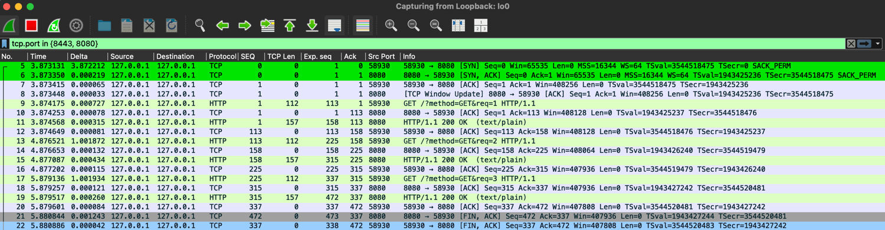

# Go HTTP client behaviour simulator

This tool simulates various network communication scenarios between a Go-based HTTP client and server.
It allows developers and network engineers to test and analyze different behaviors in client-server interactions,
such as connection handling, timeouts, and response delays.

# How to use

1. Start `tcpcump` or `wireshark` to listen on localhost interface. Then filter TCP connections on port 8080 and 8443.
2. `go run main.go -h`

## tcpdump

sudo tcpdump -n -i lo0 tcp port 8080 or tcp port 8443

### Wireshark

tcp.port in {8443, 8080}

# Observation

1. Reuse of TCP connection for multiple HTTP request
    - When a HTTP request is done within ConnectionIdleTimeout on both Server and Client, then a TCP connection is
      reused
    - Simulation 01
      - We can verify that there is one TCP handshake (SYN, SYN, ACK) for 3 HTTP requests.
      

2. Each HTTP request uses own TCP connection
    - An opened TCP connection is not reused when HTTP request is not done before IdleConnTimeout on the client or
      server side
    - Simulation 02, Simulation 03

3. TCP connection not put to the idle pool on the client
    - If the HTTP request fails on the TCP level, the TCP connection is not put to the idle pool on the client (timeout,
      RST, ..)
    - Simulation 04, Simulation 05

4. Retry by TCP layer (RoundTripper)
    - TCP connection is put to the idle pool on the client after a first successful request, after second request, the
      server closes connection with RST
    - In this case the clients RoundTripper automatically retries the HTTP request for idempotent methods GET, HEAD,
      OPTIONS, or TRACE;
      or if their [Header] map contains an "Idempotency-Key" or "X-Idempotency-Key" entry.
    - Simulation 11
    - If the connection is closed before the seconds request is sent, then the broken connection is detected before
      sending the HTTP request and a new connection is opened.
    - Simulation 13

5. Client detection of broken connections in the idle pool
    - When a server closes a connection which is in idle pool on the client side, it's detected once the client tries
      to use it
    - The client discards the broken connection and opens a new one (or uses another one form the idle pool)
    - The HTTP request is sent only once over a "ok" connection
    - Simulation 12

# TODO
- Add a images from Wireshark / tcp dump
- Add TLS simulations to the config
- Test with DELETE, HEAD requests

# More simulations ideas
- Show limit of TCP connections when MaxConnsPerHost is set
 

