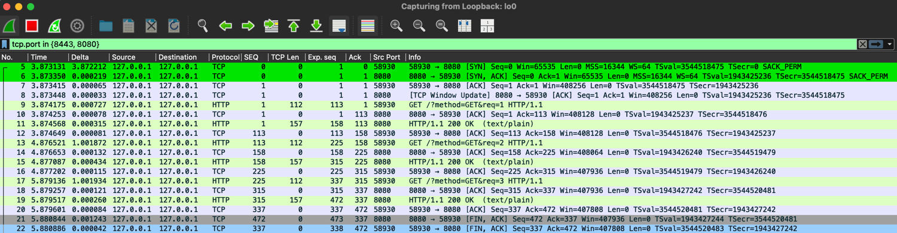
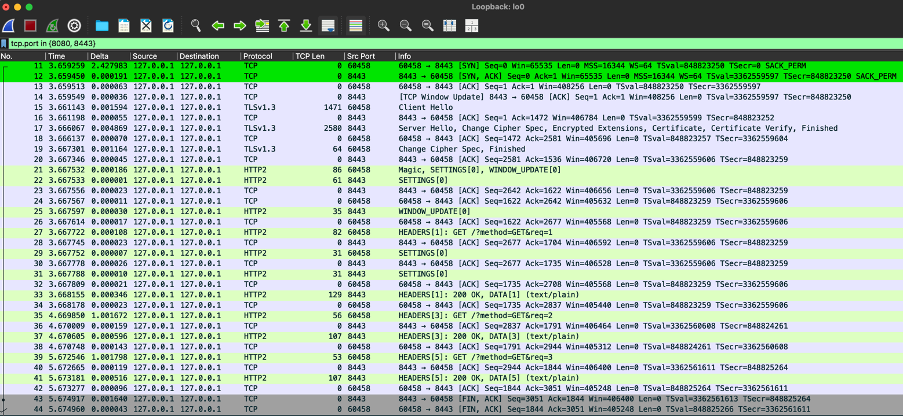
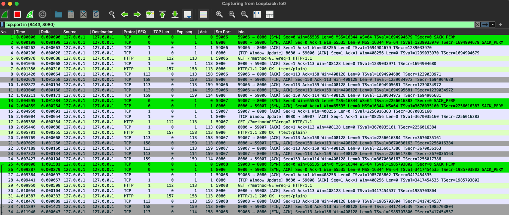
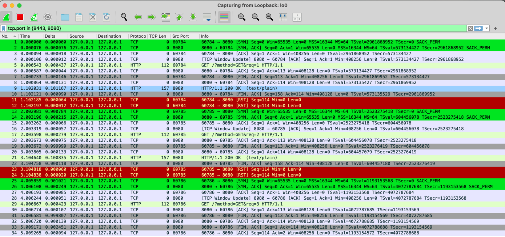
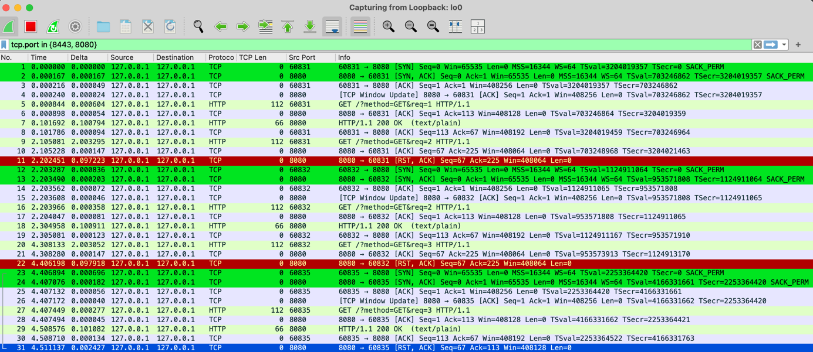
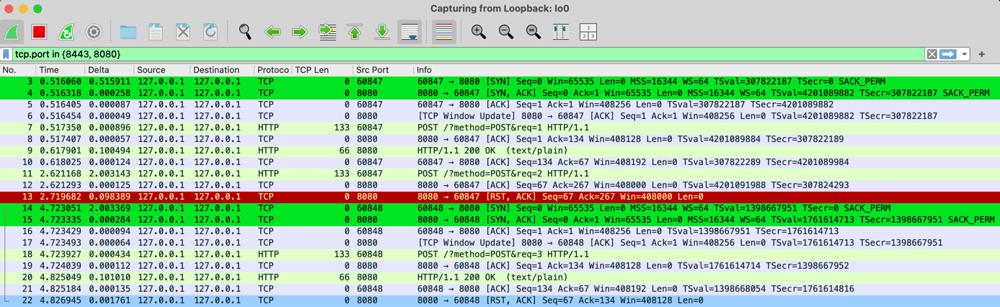
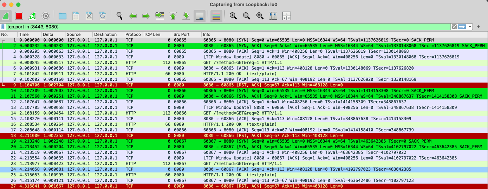
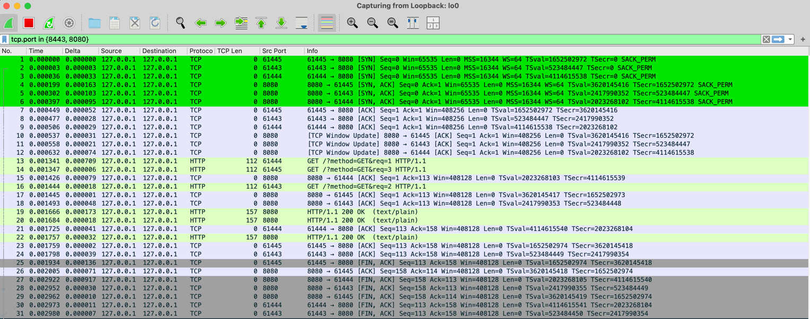
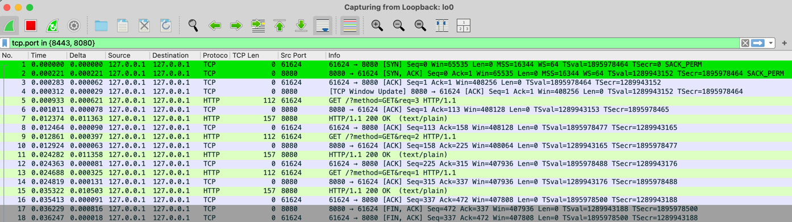

# Go HTTP client behaviour simulator

This tool simulates various network communication scenarios between a Go-based HTTP client and server.
It allows to test and analyze different behaviors in client-server interactions,
such as connection handling, timeouts, and response delays.

# How to use

1. Start `tcpcump` or `wireshark` to listen on localhost interface. Then filter TCP connections on port 8080 and 8443.
2. `go run . -sim <number>`
3. Observe the output in the console and from `tcpdump` / `wireshark`

Run `go run . -h` for list of existing simulations.

Simulations which use HTTP server can be started also with TLS (`-tls` flag). Help (`-h`) shows which are those.
Spoiler: There is no difference in how the tcp connections are reused when TLS is used. 
 
### tcpdump
```shell
sudo tcpdump -n -i lo0 tcp port 8080 or tcp port 8443
```

### Wireshark
Display filter: `tcp.port in {8443, 8080}`


#### Decrypting TLS traffic in Wireshark

1. Provide the `keylog` program argument, e.g. `go run . -sim 01 -tls -keylog /path/to/tls.log`
2. Open Wireshark and go to Wireshark/Edit → Preferences → Protocols → TLS. 
  Set the (Pre)-Master-Secret log filename to the same path.

## Example output

```shell
> go run . -sim 01
Configuration:
  ID:                           01
  Description:                  Server HTTP 200 OK response - connection reused from idle pool
  Server Address:               127.0.0.1:8080
  Use HTTP2:                    false
  Use TLS:                      false
  Server Idle Timeout:          5 sec
  Server Success On First:      false
  Server Sleep Before Response: 0.0 sec
  Server Sleep On Second:       false
  Server Sleep On Second Dur:   0.0 sec
  Client Request Type:          GET
  Client Idle Timeout:          90 sec
  Client MaxConnsPerHost:       0 (unlimited)
  Client Wait Before Next Req:  1.0 sec
  Client Timeout:               10 sec
  Request Count:                3
  Requests In Parallel:         false

Starting server on 127.0.0.1:8080

client: Sending 1. GET request...
client trace: Trying to get a connection for 127.0.0.1:8080
client trace: Dialing new connection to tcp:127.0.0.1:8080
client trace: Successfully connected to tcp:127.0.0.1:8080
client trace: Got a connection: reused=false, wasIdle=false, idleTime=0s
server: handling request GET num 1
client trace: Connection returned to idle pool
client: Response from 1. request: status: 200 OK, body: GET request handled with query number: 1
client: waiting 1 sec before sending the next request.

client: Sending 2. GET request...
client trace: Trying to get a connection for 127.0.0.1:8080
client trace: Got a connection: reused=true, wasIdle=true, idleTime=1.000948625s
server: handling request GET num 2
client trace: Connection returned to idle pool
client: Response from 2. request: status: 200 OK, body: GET request handled with query number: 2
client: waiting 1 sec before sending the next request.

client: Sending 3. GET request...
client trace: Trying to get a connection for 127.0.0.1:8080
client trace: Got a connection: reused=true, wasIdle=true, idleTime=1.001263709s
server: handling request GET num 3
client trace: Connection returned to idle pool
client: Response from 3. request: status: 200 OK, body: GET request handled with query number: 3

program: all tasks completed successfully. Exiting...
Simulation stopped.
```


# Observation

1. Reuse of TCP connection for multiple HTTP requests
    - When a HTTP request is done within ConnectionIdleTimeout on both Server and Client, then a TCP connection is
      reused
    - Simulation 01
      - We can verify that there is one TCP handshake (SYN, SYN, ACK) for 3 HTTP requests.
      
    - Simulation 20
      - Decrypted TLS traffic with HTTP2
        

2. Each HTTP request uses own TCP connection
    - An opened TCP connection is not reused when HTTP request is not done before IdleConnTimeout on the client or
      server side
    - Simulation 02, Simulation 03
      - We can see 3 TCP handshakes (SYN, SYN, ACK) for 3 HTTP connections
      
      
3. TCP connection not put to the idle pool on the client
    - If the HTTP request fails on the TCP level, the TCP connection is not put to the idle pool on the client (timeout,
      RST, ..)
    - Simulation 04, Simulation 05
      

4. Retry by TCP layer (RoundTripper)
    - TCP connection is put to the idle pool on the client after a first successful request, after second request, the
      server closes connection with RST instead of returning a HTTP response
    - In this case the clients RoundTripper automatically retries the HTTP request for idempotent methods GET, HEAD,
      OPTIONS, or TRACE;
      or if their [Header] map contains an "Idempotency-Key" or "X-Idempotency-Key" entry.
    - Simulation 06
      
    - Simulation 07 - no retry for POST request
      

5. Client detection of broken connections in the idle pool
    - When a server closes a connection which is in idle pool on the client side, it's detected once the client tries
      to use it
    - The client discards the broken connection and opens a new one (or uses another one form the idle pool)
    - The HTTP request is sent only once over a "ok" connection
    - Simulation 08
      

6. Multiple HTTP requests in parallel over separate TCP connections
    - When a client does 3 HTTP requests in parallel, 3 TCP connections are opened at once.
    - Simulation 09
      
     - This simulation also shows that default http.Transport config for http client for MaxIdleConnectionsPerHost is 2 because the third connection is not put to the idle pool. See output: `client trace: Failed to put connection back to idle pool: http: putIdleConn: too many idle connections for host`
     
7. Multiple HTTP requests in parallel done in series via 1 TCP connection
    - When a client does 3 HTTP requests in parallel while the http.Transport config MaxConnsPerHost is set to 1, they will be serialized over 1 TCP connection.
    - Simulation 10
      

